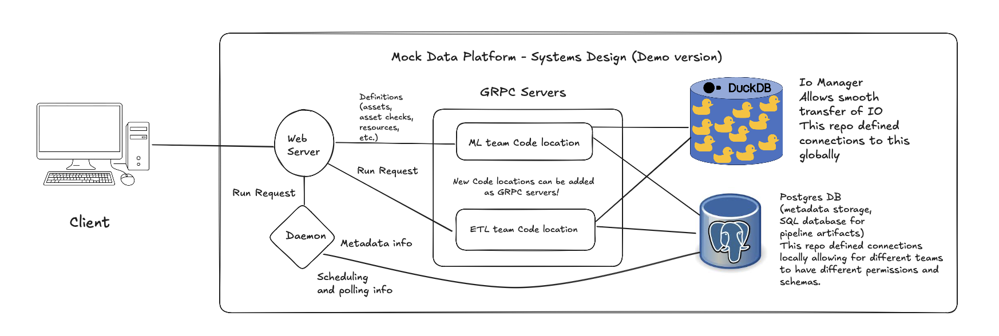
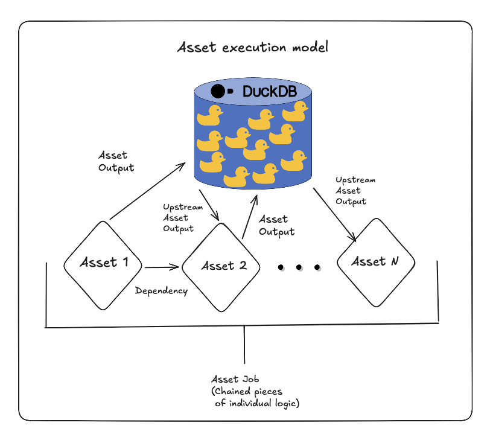

# Dagster Multi-Team Data Platform (Reference Implementation)

## Overview

This repository is a **reference implementation of a multi-team data orchestration platform built on Dagster**.

It shows how an organization can:

- Run **one centralized orchestration layer**
- Allow **multiple teams to deploy independently**
- Enforce **data validation before execution**
- Maintain **clear ownership boundaries**
- Integrate **real-time streaming alongside batch orchestration**

Think of this project as:

> A platform design example for generalized orchestration tasks
> Not just a single pipeline

The focus is on **architecture and execution semantics**, not cloud infrastructure.

---

## Architecture Diagrams

**System design overview**



**Asset execution and validation model**



---

## What This Demonstrates

This platform demonstrates how to:

- Isolate teams using separate code locations
- Enforce asset checks as hard execution gates
- Keep orchestration centralized but compute decentralized
- Prevent one team's failure from breaking others
- Provide a clean path from local development to production
- Integrate streaming infrastructure (Kafka + PySpark) with batch orchestration (Dagster)
- Use Dagster sensors for event-driven materialization of streaming data

---

## Mental Model

### Control Plane (central Dagster daemon & webserver)

Responsible for:

- Scheduling
- Dependency resolution
- Run tracking
- Observability

### Execution Plane (team code locations)

Each team:

- Owns its assets
- Owns its checks
- Runs its own compute
- Deploys independently

The control plane never runs business logic.

---

## Streaming Architecture

### Data Flow

```text
CoinGecko API --> Kafka Producer --> Kafka (KRaft) --> PySpark Structured Streaming --> Postgres (staging)
                                                                                            |
                                                                          Dagster Sensor (polls every 60s)
                                                                                            |
                                                                          crypto_prices_snapshot asset
                                                                                            |
                                                                                    DuckDB (via IO manager)
```

### How It Works

1. A **Kafka producer** fetches live crypto prices (BTC, ETH, SOL, ADA, DOT) from the CoinGecko API every 30 seconds and publishes them to a Kafka topic
2. A **PySpark Structured Streaming** job consumes from Kafka and writes micro-batches to a Postgres staging table via JDBC
3. A **Dagster sensor** in the ETL code location polls the Postgres table every 60 seconds. When new rows are detected, it triggers the `streaming_ingest_job`
4. The `crypto_prices_snapshot` asset reads from Postgres and materializes the data into DuckDB through the shared IO manager

Streaming is handled entirely by Spark. Dagster's role is to observe the staging table and orchestrate the final materialization, not to manage the stream itself.

### Components

| Container | Role | Image |
|-----------|------|-------|
| `kafka` | KRaft-mode broker (no Zookeeper) | `apache/kafka:3.8.1` |
| `kafka_producer` | CoinGecko API poller, publishes to Kafka | Custom (Python + confluent-kafka) |
| `spark_consumer` | Structured Streaming: Kafka to Postgres | Custom (PySpark 3.5.4) |

### Production Note: Change Data Capture at Scale

This demo uses a simple API-to-Kafka producer pattern. In a production environment with high-volume streaming workloads, the architecture would extend to a full CDC pipeline:

```text
Source DB --> Debezium CDC --> Kafka (raw topic) --> staging table
                                                        |
                                                    Dagster (validate, transform, enrich)
                                                        |
                                                    Kafka (clean topic) --> final table
```

Each stage in this pipeline is independently buffered. Debezium captures row-level changes without polling the source database. The staging table absorbs burst writes so that Dagster can process at its own pace. Publishing back to Kafka after transformation gives downstream consumers a clean, validated stream and decouples the processing speed from the ingestion rate.

This matters because in production the source stream may produce millions of events per minute. Without this staged decoupling, a slow transformation step would backpressure the entire pipeline. With it, each component scales independently and failures at one stage do not cascade to others.

### Latency Considerations

The CDC pattern above is designed for **near-real-time** workloads where processing within a few minutes is acceptable. Dagster sensors poll on an interval (seconds to minutes), and each triggered run has scheduling and startup overhead. This is the right fit for analytics, warehousing, and most data platform use cases.

For **sub-second latency** requirements (live dashboards, fraud detection, real-time pricing), Dagster should not be in the hot path. In that case, the transform layer would be a dedicated stream processor:

```text
Source DB --> Debezium CDC --> Kafka (raw) --> Faust / Kafka Streams / Spark Streaming (transform)
                                                        |
                                                  Kafka (clean) --> final table / real-time consumers
                                                        |
                                                  Dagster (periodic audit, reconciliation, monitoring)
```

In this design, a lightweight stream processor (Faust, Kafka Streams, or Spark Structured Streaming) handles validation and transformation continuously with millisecond-level latency. Kafka acts as the sole transport between stages. Dagster steps back from the hot path entirely and instead runs periodic audits — reconciling counts between the raw and clean topics, detecting drift, flagging anomalies, and materializing aggregated snapshots to the warehouse on a schedule.

The two patterns are not mutually exclusive. A production platform often runs both: the stream processor handles the real-time path while Dagster manages the batch/analytical path and provides observability across the whole system.

---

## Key Guarantees

The platform enforces three core invariants:

### 1. Team Isolation

A failure in one team's code cannot stop another team's pipelines.

### 2. Validation-Gated Execution

Downstream assets **will not run** unless upstream checks pass.

Bad data cannot silently flow downstream.

### 3. Clear Ownership

Every asset and check has exactly one owning team.

No hidden coupling.

---

## Repository Structure

```text
code_locations/
  etl_pipeline/          # ETL team: batch ingest, streaming sensor, crypto materialization
  basic_ml_pipeline/     # ML team: model training and registry
  shared/                # Shared resources (DuckDB IO manager, DB client)
kafka_producer/          # Standalone Kafka producer (CoinGecko API)
spark_consumer/          # PySpark Structured Streaming consumer
deployment/
  docker-compose.yaml    # Local dev compose (builds from source)
  dockerfiles/           # All Dockerfiles
  workspace.yaml         # Dagster code location registry
  dagster.yaml           # Dagster instance config
docker-compose.yaml      # Production compose (pre-built images)
Makefile                 # Dev commands
```

- Each folder under `code_locations/` is a **team deployment unit**
- `shared/` contains reusable utilities
- `kafka_producer/` and `spark_consumer/` are standalone applications, not Dagster code locations
- Teams can be added without modifying existing teams

---

## Quick Start (Local)

### Prerequisites

- Docker Desktop
- Git
- macOS or Linux

### Run the platform

```bash
git clone https://github.com/ajohnson114/data_platform.git
cd data_platform
make
```

Open the Dagster UI:

http://localhost:3000

---

## Example Execution Behavior

### `etl_job`

- Creates database tables
- Loads mock data

### `ml_pipeline_job`

- Depends on ETL outputs
- Intentionally fails if prerequisites are missing

### `streaming_ingest_job`

- Triggered automatically by the `crypto_price_sensor`
- Reads crypto prices from Postgres (written by Spark) and materializes to DuckDB
- Runs whenever new streaming data is detected

Some failures are intentional and part of the demo.

---

## Production Mapping (Conceptual)

This repo runs locally but maps cleanly to production:

| Local | Production |
|------|-----------|
| Docker Compose | Kubernetes / Helm |
| Local executor | K8sJobExecutor / Celery |
| DuckDB | S3 / data lake |
| Local Postgres | Managed cloud SQL |
| Makefile | CI/CD pipelines |
| Single Kafka broker (KRaft) | Multi-broker Kafka cluster |
| CoinGecko API producer | Debezium CDC connectors |
| PySpark local[*] | Spark on YARN / K8s |

The architecture is designed so production hardening can be added **without changing core abstractions**.

---

## Why This Exists

This project is meant to demonstrate:

- Platform-level thinking
- Correct abstraction boundaries
- Multi-team scalability patterns
- Validation-driven data systems
- Streaming and batch integration patterns

---

## Usage Notice

This repository contains work samples for review purposes only.

- Commercial use is prohibited
- Personal or educational use may be granted with permission

**Contact:**
ajohnson0764 [at] gmail [dot] com
