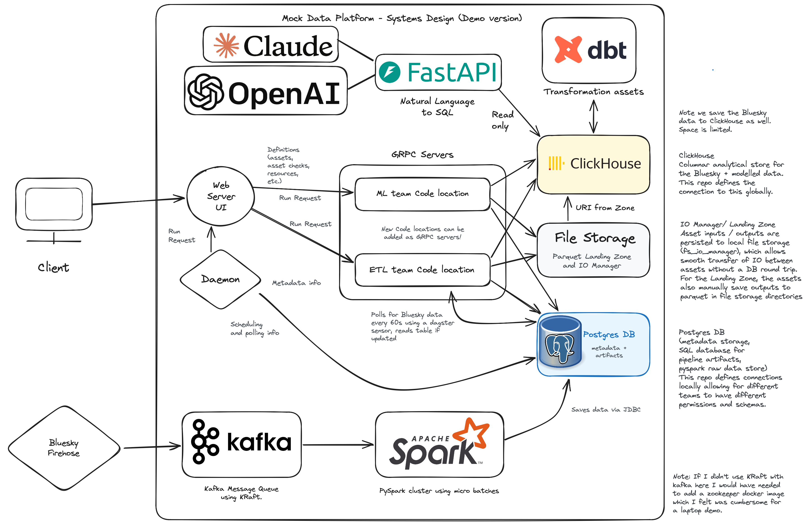
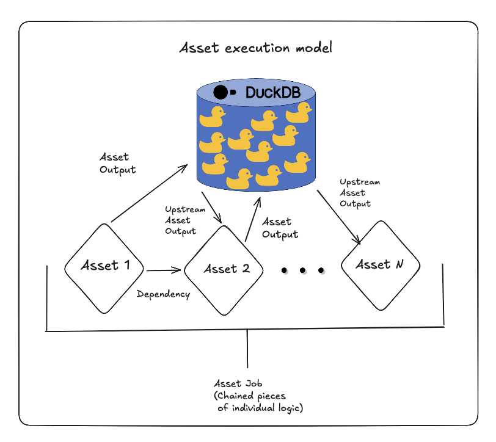
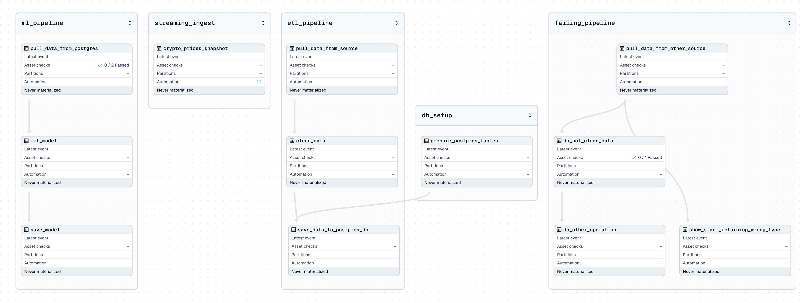
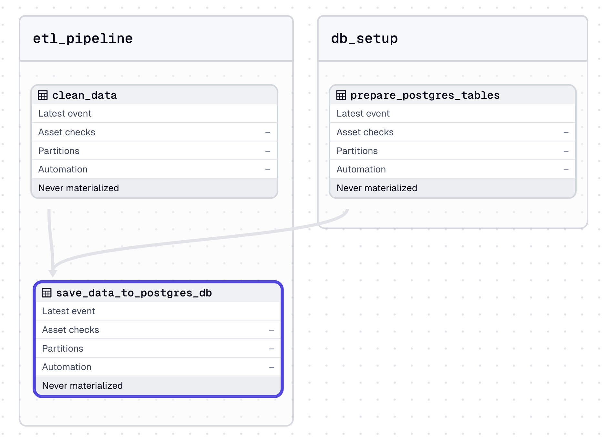
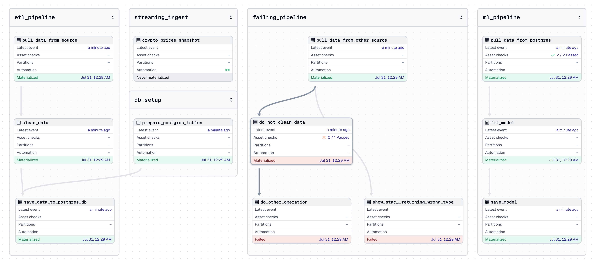
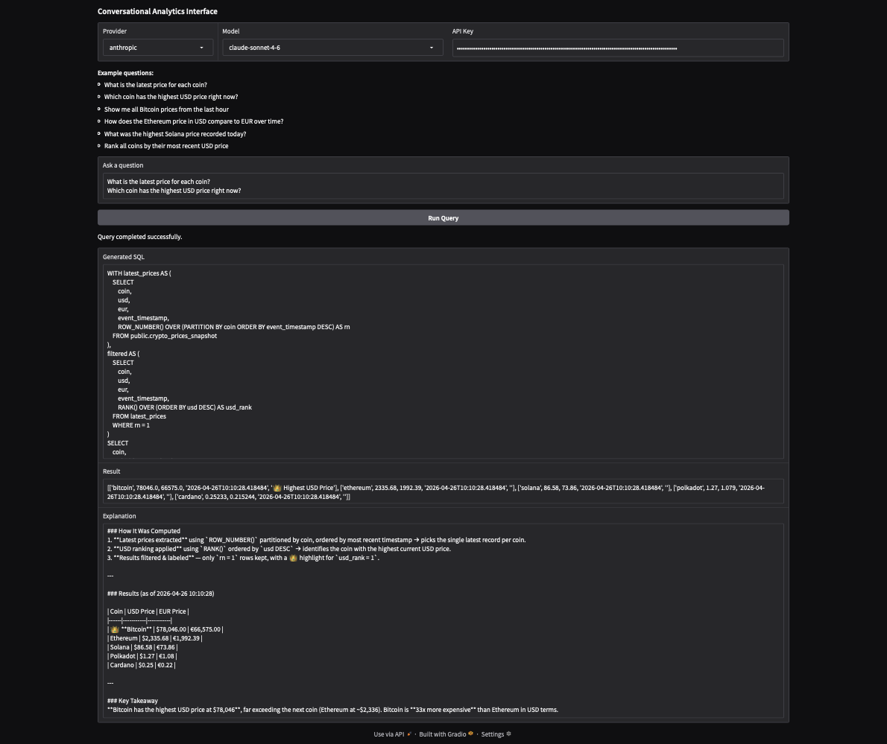

# Data Platform — Multi-Service Orchestration with Dagster

A local-first data platform that runs **Kafka, Spark, Postgres, DuckDB, and Dagster** in a single `make` command. Designed as a reference implementation for multi-team data orchestration — not a single pipeline, but a platform where multiple teams deploy independently, validate each other's outputs at boundaries, and react to data as it arrives.

## Contents

- [What This Runs](#what-this-runs)
- [Architecture](#architecture)
- [Asset Lineage](#asset-lineage)
- [Execution Results](#execution-results)
- [Streaming Pipeline](#streaming-pipeline)
- [Validation-Gated Execution](#validation-gated-execution)
- [Conversational Analytics Interface](#conversational-analytics-interface)
- [Repository Structure](#repository-structure)
- [Environment Configuration](#environment-configuration)
- [Design Decisions](#design-decisions)
- [Production Mapping](#production-mapping)
- [Quick Start](#quick-start)
- [Example Execution Behavior](#example-execution-behavior)
- [Usage Notice](#usage-notice)

---

## What This Runs

```
make
# → spins up 10 containerized services
# → opens Dagster UI at http://localhost:3000
```

| Service | Role |
|---|---|
| **Kafka** | Message broker for streaming financial data |
| **Kafka Producer** | Polls crypto price data and publishes to Kafka |
| **Spark Consumer** | Reads from Kafka via Structured Streaming, writes to Postgres |
| **Postgres** | Stores streaming data + Dagster run metadata |
| **DuckDB IO Manager** | Shared analytical store across code locations |
| **Dagster Webserver** | UI and API layer (control plane) |
| **Dagster Daemon** | Scheduling, sensors, and run queue (control plane) |
| **ETL Code Location** | Team-owned pipeline: pulls, validates, cleans, and loads data |
| **ML Code Location** | Team-owned pipeline: validates ETL output schema, then runs downstream modeling |
| **Analytics API** | NL-to-SQL interface over the DuckDB warehouse (optional, `dev-nl2sql` profile) |

All images are pre-built and published to Docker Hub — no local builds required.

---

## Architecture

The platform is structured around three planes that never mix responsibilities:

**Control plane** (Dagster webserver + daemon): Handles scheduling, dependency resolution, run tracking, and observability. Never executes business logic.

**Execution plane** (code locations): Each team owns its assets, checks, and compute. Teams deploy independently via separate gRPC code servers. A failure or dependency conflict in one team's container cannot affect another team's pipelines.

**Data plane** (DuckDB): Shared analytical store mounted as a Docker volume. All code locations read and write through a shared IO manager, giving every team access to the same warehouse without coupling their code.





### Key Guarantees

**Team isolation** — Each code location is a separate container with separate dependencies. A crash or import error in one team's code cannot stop another team's pipelines from running.

**Validation-gated execution** — Asset checks use `blocking=True`. Dagster will not execute any downstream asset if an upstream check fails. Bad data stops at the boundary, not silently downstream.

**Clear ownership** — Every asset and every check has exactly one owning team. No shared mutable state, no hidden coupling across boundaries.

---

## Asset Lineage

The Dagster UI renders the full dependency graph across every asset group and both code locations (**Lineage**, with all groups expanded):



Cross-team dependencies are first-class. `save_data_to_postgres_db` (ETL team) depends on `clean_data` from its own group and `prepare_postgres_tables` from the `db_setup` group — the UI draws that contract across the group boundary:



> **Tip:** The Dagster UI defaults to a horizontal graph layout, which draws edges awkwardly for graphs like this one with cross-group dependencies. The screenshots above use the vertical orientation — in the lineage view, click the gear icon in the bottom-right of the graph pane and select **Change graph to vertical orientation** (`⌥O`/`Option + O`). The setting is remembered per browser.

---

## Execution Results

The same graph after running `etl_job`, `ml_pipeline_job`, and `failing_job`. Every asset carries its live status, so a reviewer can read pipeline health directly off the lineage view:



**Green = materialized.** The full ETL chain (`pull_data_from_source` → `clean_data` → `save_data_to_postgres_db`), the `db_setup` table preparation, and the entire ML chain completed. `pull_data_from_postgres` shows **2 / 2 Passed**: the ML team's cross-team schema checks validated the ETL team's output before any modeling ran.

**Red = failed.** In `failing_pipeline`, `do_not_clean_data` materialized but its blocking null check failed (**0 / 1 Passed**), so Dagster halted the run at the boundary. Downstream `do_other_operation` is marked failed without executing its business logic. `show_stack_trace_for_returning_wrong_type` fails outright by returning a type that violates its output contract. The darker edges trace the failed run's execution path.

**Gray = never materialized.** `crypto_prices_snapshot` is fed by the streaming stack (Kafka + Spark), which was not running for this capture. When the platform runs with streaming enabled, the `crypto_price_sensor` materializes it automatically as data arrives.

These failures are intentional, see [Example Execution Behavior](#example-execution-behavior) for what each job is designed to demonstrate.

---

## Streaming Pipeline

The platform includes a real streaming data path:

```
Crypto API → Kafka Producer → Kafka → Spark Structured Streaming → Postgres → Dagster Sensor → DuckDB
```

The Kafka producer polls crypto prices every 30 seconds. Spark reads the stream via Structured Streaming and writes micro-batches to Postgres. A Dagster sensor (`crypto_price_sensor`) watches the Postgres table every 60 seconds using cursor-based state tracking — when it detects new rows, it automatically triggers the `streaming_ingest_job`, which materializes the data into DuckDB through the `crypto_prices_snapshot` asset.

The entire path from external API to analytical store is automated and event-driven. No schedules, no manual triggers — the sensor reacts to data as it arrives.

```python
@sensor(job_name="streaming_ingest_job", minimum_interval_seconds=60,
        default_status=DefaultSensorStatus.RUNNING)
def crypto_price_sensor(context: SensorEvaluationContext):
    # Cursor-based: only triggers when row count increases
    last_count = int(context.cursor) if context.cursor else 0
    if current_count > last_count:
        context.update_cursor(str(current_count))
        yield RunRequest(run_key=f"crypto_ingest_{current_count}")
```

### Streaming Components

| Container | Role | Image |
|-----------|------|-------|
| `kafka` | KRaft-mode broker (no Zookeeper) | `apache/kafka:3.8.1` |
| `kafka_producer` | CoinGecko API poller, publishes to Kafka | Custom (Python + confluent-kafka) |
| `spark_consumer` | Structured Streaming: Kafka to Postgres | Custom (PySpark 3.5.4) |

### Production Note: Change Data Capture at Scale

This demo uses a simple API-to-Kafka producer pattern. In a production environment with high-volume streaming workloads, the architecture would extend to a full CDC pipeline:

```text
Source DB --> Debezium CDC --> Kafka (raw topic) --> staging table
                                                        |
                                                    Dagster (validate, transform, enrich)
                                                        |
                                                    Kafka (clean topic) --> final table
```

Each stage in this pipeline is independently buffered. Debezium captures row-level changes without polling the source database. The staging table absorbs burst writes so that Dagster can process at its own pace. Publishing back to Kafka after transformation gives downstream consumers a clean, validated stream and decouples processing speed from ingestion rate.

This matters because in production the source stream may produce millions of events per minute. Without this staged decoupling, a slow transformation step would backpressure the entire pipeline. With it, each component scales independently and failures at one stage do not cascade to others.

### Latency Considerations

The CDC pattern above is designed for **near-real-time** workloads where processing within a few minutes is acceptable. Dagster sensors poll on an interval (seconds to minutes), and each triggered run has scheduling and startup overhead. This is the right fit for analytics, warehousing, and most data platform use cases.

For **sub-second latency** requirements (live dashboards, fraud detection, real-time pricing), Dagster should not be in the hot path. In that case, the transform layer would be a dedicated stream processor:

```text
Source DB --> Debezium CDC --> Kafka (raw) --> Faust / Kafka Streams / Spark Streaming (transform)
                                                        |
                                                  Kafka (clean) --> final table / real-time consumers
                                                        |
                                                  Dagster (periodic audit, reconciliation, monitoring)
```

In this design, a lightweight stream processor handles validation and transformation continuously with millisecond-level latency. Dagster steps back from the hot path entirely and instead runs periodic audits — reconciling counts between the raw and clean topics, detecting drift, flagging anomalies, and materializing aggregated snapshots to the warehouse on a schedule.

The two patterns are not mutually exclusive. A production platform often runs both: the stream processor handles the real-time path while Dagster manages the batch/analytical path and provides observability across the whole system.

---

## Validation-Gated Execution

Asset checks act as hard execution gates. Every check uses `blocking=True`, meaning Dagster will not execute downstream assets if any check fails. Bad data stops at the boundary.

### Within a team: null checks

The ETL pipeline validates its own data before passing it downstream:

```python
@asset_check(asset="do_not_clean_data", blocking=True)
def check_no_nulls_in_required_columns(do_not_clean_data: pd.DataFrame) -> AssetCheckResult:
    columns_to_check = get_config().get_cols_required_to_not_have_nulls()
    null_counts = df[columns_to_check].isna().sum()
    ...
    return AssetCheckResult(passed=total_nulls == 0, metadata={...})
```

### Across teams: schema drift detection

The ML pipeline doesn't trust the ETL pipeline's output blindly. Before using any data, it runs its own checks against `pull_data_from_postgres` — the asset that consumes ETL output:

```python
@asset_check(asset="pull_data_from_postgres", name="schema_matches_etl_table", blocking=True)
def check_schema_matches_etl_table(pull_data_from_postgres: pd.DataFrame) -> AssetCheckResult:
    expected_schema = {
        col: TYPE_MAPPING[spec["type"]]
        for col, spec in get_config().get_expected_schema_from_etl_pipeline().items()
    }
    # Checks for missing columns AND wrong dtypes
    ...
    return AssetCheckResult(passed=passed, metadata={
        "missing_columns": missing_columns,
        "columns_with_wrong_dtype": wrong_type_columns,
        "observed_dtypes": {col: str(df[col].dtype) for col in df.columns},
    })
```

This is the cross-team contract pattern: the ML team defines what schema it expects from the ETL team's output, and the pipeline will not proceed if the contract is violated. Each team owns its own validation — no hidden coupling, no silent failures across boundaries.

---

## Conversational Analytics Interface

The platform includes an optional NL-to-SQL service that exposes the DuckDB warehouse through a natural language interface. The data it queries was ingested through the live streaming pipeline — the full path from CoinGecko API to conversational query is connected end-to-end.

```bash
make dev-nl2sql
# → starts the full platform plus the analytics service
# → opens the query interface at http://localhost:7860
```

### How It Works

A FastAPI backend receives a natural language question along with an LLM provider, model, and API key. The LLM is given the table schema and the current maximum timestamp in the dataset, generates a SQL query, which is validated and executed against DuckDB. The LLM then explains the result in plain English.

```
Question → LLM (schema + timestamp context) → SQL → Guardrail validation → DuckDB → LLM explanation → Answer
```

### Guardrails

Generated SQL is validated before execution:

- Only `SELECT` and `WITH` statements are permitted
- Multiple statements (semicolons) are blocked
- DDL and mutation operations (`INSERT`, `UPDATE`, `DELETE`, `DROP`, `ALTER`, `CREATE`, `ATTACH`, `COPY`) are blocked using word-boundary regex to prevent bypass attempts
- Trailing semicolons and code fences are stripped before validation

Ambiguous questions return a clarification prompt. Out-of-domain questions return a polite rejection. Neither reaches the database.

### LLM Context

The system prompt gives the model two pieces of context beyond the question:

1. **The table schema** — column names and types so the LLM generates valid SQL against the actual data model
2. **The max dataset timestamp** — so relative date queries ("prices from the last hour", "today's high") are evaluated against the actual data range, not the current wall clock

### Provider Support

Select your LLM provider and model directly in the Gradio UI — no environment variables required. Paste your API key into the interface at runtime.

| Provider | Models |
|---|---|
| OpenAI | gpt-5.4-mini, gpt-5.4-nano, gpt-5.4, gpt-5.5 |
| Anthropic | claude-sonnet-4-6, claude-haiku-4-5-20251001, claude-opus-4-6, claude-opus-4-7 |

### Example Questions

Once the streaming pipeline has been running for a few minutes:

- *What is the latest price for each coin?*
- *Which coin has the highest USD price right now?*
- *Show me all Bitcoin prices from the last hour*
- *How does the Ethereum price in USD compare to EUR over time?*
- *What was the highest Solana price recorded today?*
- *Rank all coins by their most recent USD price*



---

## Repository Structure

```text
code_locations/
  etl_pipeline/          # ETL team: assets, checks, jobs, sensors, resources
  basic_ml_pipeline/     # ML team: assets, cross-team schema checks, jobs
  shared/                # Shared resources (DuckDB IO manager, DB client)
kafka_producer/          # Standalone service: polls crypto API → Kafka
spark_consumer/          # Standalone service: Kafka → Spark → Postgres
services/
  analytics_api/         # NL-to-SQL service: FastAPI + Gradio UI (optional)
deployment/
  docker-compose.yaml    # Local dev compose (builds from source)
  dockerfiles/           # All Dockerfiles
  workspace.yaml         # Dagster code location registry
  dagster.yaml           # Dagster instance config
docker-compose.yaml      # Production compose (pre-built images)
Makefile                 # One-command startup
```

- Each folder under `code_locations/` is a team deployment unit
- `shared/` contains reusable utilities
- `kafka_producer/` and `spark_consumer/` are standalone applications, not Dagster code locations
- `services/` contains optional platform-level services
- Teams can be added without modifying existing teams

---

## Environment Configuration

Each code location manages its own environment-scoped config and secrets, loaded at runtime based on the `ENV` variable set by the Makefile (`dev`, `uat`, `prod`).

```text
code_locations/
  etl_pipeline/config/
    config/
      config.dev.yaml    # DB connection details, SQL, asset check params
      config.uat.yaml
      config.prod.yaml
    secrets/
      secrets.dev.yaml   # DB credentials
      secrets.uat.yaml
      secrets.prod.yaml
  basic_ml_pipeline/config/
    (same structure)
```

Config files contain non-sensitive runtime parameters (hostnames, table names, SQL statements). Secrets files contain credentials. The split mirrors how a production system would separate config management from secret management — config files map directly to Kubernetes ConfigMaps, and secrets files map directly to Kubernetes Secrets (or a Vault-backed equivalent).

Running `make`, `make uat`, or `make prod` injects the correct `ENV` value into each container, which loads the corresponding file pair at startup.

---

## Design Decisions

**Why separate code locations instead of one monolith?**
Each code location runs in its own container with its own dependencies. A failure or dependency conflict in one team's code cannot break another team's pipelines.

**Why DuckDB as the IO manager?**
It keeps the platform self-contained — no cloud credentials needed to run locally. The architecture maps cleanly to S3 / a data lake in production.

**Why Kafka + Spark for streaming?**
Demonstrates that the platform handles both batch orchestration (Dagster) and stream processing (Spark), with Dagster observing and materializing the streaming outputs rather than managing the stream itself.

**Why a singleton config pattern?**
Keeps the demo readable. In production this could be replaced with Pydantic models, dbt-generated configs, or environment-specific overrides while the interface stays the same.

**Why NL-to-SQL as a platform service?**
LLM-powered query interfaces are increasingly a first-class concern for data platforms. Building it as a separate optional service (Docker Compose profile) shows how platform capabilities can be layered on top of the orchestration stack without modifying it.

---

## Production Mapping

| Local | Production |
|---|---|
| Docker Compose | Kubernetes / Helm |
| Local executor | K8sJobExecutor / Celery |
| DuckDB | S3 / data lake |
| Local Postgres | Managed cloud SQL (RDS, Cloud SQL) |
| Makefile | CI/CD pipelines |
| Kafka (single node) | Managed Kafka (MSK, Confluent) |
| Spark (local) | EMR / Dataproc / Databricks |
| CoinGecko API producer | Debezium CDC connectors |
| NL-to-SQL service | Integrated analytics product layer |
| Config YAML files | Kubernetes ConfigMaps |
| Secrets YAML files | Kubernetes Secrets / Vault |

The architecture is designed so production hardening can be added without changing core abstractions.

---

## Quick Start

**Prerequisites:** Docker Desktop, Git, macOS or Linux

```bash
git clone https://github.com/ajohnson114/data_platform.git
cd data_platform
make
```

Open the Dagster UI at `http://localhost:3000`.

### Run with the NL-to-SQL analytics interface

```bash
make dev-nl2sql
```

Starts the full platform plus the analytics service. Open the query interface at `http://localhost:7860`. Select your LLM provider, choose a model, and paste your API key directly into the UI — no environment variables required.

---

## Example Execution Behavior

### `etl_job`
- Creates database tables
- Loads mock data

### `ml_pipeline_job`
- Depends on ETL outputs
- Intentionally fails if prerequisites are missing

### `streaming_ingest_job`
- Triggered automatically by the `crypto_price_sensor`
- Reads crypto prices from Postgres (written by Spark) and materializes to DuckDB
- Runs whenever new streaming data is detected

Some failures are intentional and part of the demo.

---

## Usage Notice

This repository is a work sample for review purposes.
Commercial use is prohibited. Personal or educational use may be granted with permission.

**Contact:** ajohnson0764 [at] gmail [dot] com
