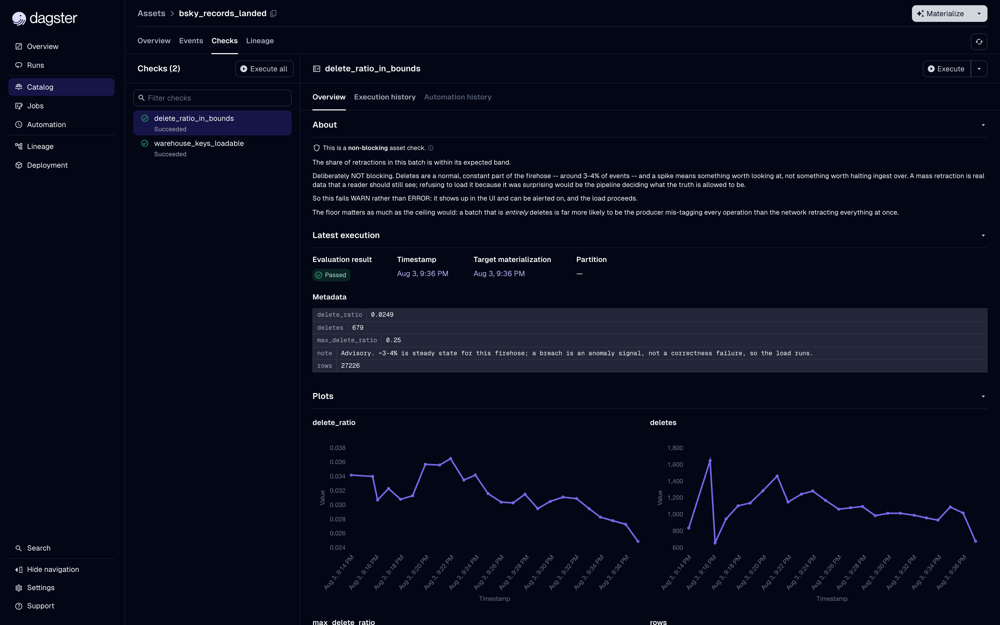

# Data Platform — Multi-Service Orchestration with Dagster

A local-first data platform that runs **Kafka, Spark, Postgres, ClickHouse, and Dagster** in a single `make` command. Designed as a reference implementation for multi-team data orchestration — not a single pipeline, but a platform where multiple teams deploy independently, validate each other's outputs at boundaries, and react to data as it arrives.

## Contents

- [What This Runs](#what-this-runs)
- [Architecture](#architecture)
- [Asset Lineage](#asset-lineage)
- [Execution Results](#execution-results)
- [Streaming Pipeline](#streaming-pipeline)
- [When the Purge Took the Warehouse Down](#when-the-purge-took-the-warehouse-down)
- [Validation-Gated Execution](#validation-gated-execution)
- [Transformation Layer (dbt)](#transformation-layer-dbt)
- [Conversational Analytics Interface](#conversational-analytics-interface)
- [Repository Structure](#repository-structure)
- [Environment Configuration](#environment-configuration)
- [Design Decisions](#design-decisions)
- [Production Mapping](#production-mapping)
- [Quick Start](#quick-start)
- [Example Execution Behavior](#example-execution-behavior)
- [Usage Notice](#usage-notice)

---

## What This Runs

```
make
# → spins up 9 containerized services (10 with the NL-to-SQL profile)
# → opens Dagster UI at http://localhost:3000
```

| Service | Role |
|---|---|
| **Kafka** | Message broker buffering the Bluesky firehose |
| **Kafka Producer** | Subscribes to Bluesky's Jetstream firehose and publishes to Kafka |
| **Spark Consumer** | Reads from Kafka via Structured Streaming, writes to Postgres |
| **Postgres** | Operational store: the streaming change log + Dagster run metadata |
| **ClickHouse** | Analytical warehouse: one table per asset, shared across code locations |
| **Dagster Webserver** | UI and API layer (control plane) |
| **Dagster Daemon** | Scheduling, sensors, and run queue (control plane) |
| **ETL Code Location** | Team-owned pipeline: pulls, validates, cleans, and loads data |
| **ML Code Location** | Team-owned pipeline: validates ETL output schema, then runs downstream modeling |
| **Analytics API** | NL-to-SQL interface over the ClickHouse warehouse (optional, `dev-nl2sql` profile) |

All images are pre-built and published to Docker Hub — no local builds required.

---

## Architecture

The platform is structured around three planes that never mix responsibilities:

**Control plane** (Dagster webserver + daemon): Handles scheduling, dependency resolution, run tracking, and observability. Never executes business logic. Runs go through a `QueuedRunCoordinator` rather than launching on submission — with a sensor firing every 60 seconds against a firehose, and the default run launcher executing runs *inside* the code location container, the queue is a memory budget as much as a scheduling policy. A tag limit holds `streaming_ingest_job` to one run at a time so two ingests can't read the same extract watermark and re-land the same id range.

**Data plane, second hop.** The warehouse reads the landed Parquet *itself* — `file()` under Compose, `s3()` on EKS — so the bytes never cross the code location. Same code path in both environments, which is the point: a bug in the load is reproducible under `make` rather than only in the cluster. The landing volume is mounted read-only into the ClickHouse container to make the local half of that true. A `FrameLoader` fallback still pulls the file through pandas, for a landing zone the warehouse cannot reach, and the choice between them is derived from the zone rather than configured beside it — there is no such thing as a direct load out of storage the warehouse cannot see, so that pairing is unrepresentable rather than validated.

**Execution plane** (code locations): Each team owns its assets, checks, and compute. Teams deploy independently via separate gRPC code servers. A failure or dependency conflict in one team's container cannot affect another team's pipelines.

**Data plane** (Postgres + ClickHouse): Postgres is the operational landing store — Spark writes the stream into it, and the ETL pipeline persists its output there. ClickHouse is the analytical warehouse. Assets write to it explicitly through a shared `ClickHouseResource` (`write_table` / `read_table` / `query_df`), one table per asset in the `analytics` database, so every team reads the same warehouse without coupling to another team's code. It is the same service in both worlds: a `clickhouse` container under Docker Compose, a `clickhouse` StatefulSet on EKS. Assets address it identically either way.

Dagster's IO manager is a separate concern. It only carries intermediate values between steps, so it stays stock and is chosen from config — `FilesystemIOManager` locally (`type: fs`), `S3PickleIOManager` on AWS (`type: s3`, reusing the compute-logs bucket under a `dagster-io/` prefix). No custom IO manager code.

```text
Jetstream  → Kafka Producer → Kafka → Spark Structured Streaming → Postgres.bsky_records
                                                                        │
                          Dagster sensor → bsky_records_snapshot ────────┤
                                                                        ├→ ClickHouse ─┬→ NL-to-SQL
generated → clean → save_data_to_postgres_db → Postgres.etl_table       │  (analytics)  └→ ml_pipeline
                                     └→ etl_table_snapshot ─────────────┘
```


### Key Guarantees

**Team isolation** — Each code location is a separate container with separate dependencies. A crash or import error in one team's code cannot stop another team's pipelines from running.

**Validation-gated execution** — Asset checks use `blocking=True`. Dagster will not execute any downstream asset if an upstream check fails. Bad data stops at the boundary, not silently downstream.

**Clear ownership** — Every asset and every check has exactly one owning team. No shared mutable state, no hidden coupling across boundaries.

---

## Asset Lineage

The Dagster UI renders the full dependency graph across every asset group and both code locations (**Lineage**, with all groups expanded):


> The same graph is committed as [`docs/asset_lineage_global.svg`](docs/asset_lineage_global.svg) — vector, exported from the UI, and worth opening if you want to read the individual cards rather than squint at them.

**Cross-team dependencies are first-class.** `save_data_to_postgres_db` (ETL team) depends on `clean_data` from its own group *and* on `prepare_postgres_tables` from `db_setup` — the UI draws that contract across the group boundary rather than hiding it inside a job. The same holds one hop out, where `streaming_ingest` hands `bsky_records_snapshot` to the dbt marts in `analytics_dbt`: two different owners, one edge, drawn.

Every asset also carries the technology it touches — Postgres, Parquet, ClickHouse, dbt, Scikit Learn. That is what makes the graph readable as a system rather than as a list of Python functions.

> **Tip:** the graph above is the UI's default horizontal layout. For graphs with a lot of cross-group edges the vertical orientation often reads better — in the lineage view, click the gear icon in the bottom-right of the graph pane and select **Change graph to vertical orientation** (`⌥O`/`Option + O`). The setting is remembered per browser.

---

## Execution Results

That graph is not a diagram of what the platform *could* do — it is the live state after `etl_job`, `ml_pipeline_job` and `failing_job` have run with the streaming sensor going. Every asset carries its own status and check counts, so pipeline health reads straight off the lineage view. Scroll back up to it while reading this.

**Green = materialized.** The ETL chain (`pull_data_from_source` → `clean_data` → `save_data_to_postgres_db` → `etl_table_landed` → `etl_table_snapshot`), the `db_setup` table preparation, the ML chain and the four dbt models all completed.

> `prepare_postgres_tables` is the one card in that graph reading `Loading…` rather than a status. The UI virtualises cards that are off-screen, and `db_setup` sits at the far right edge — so it had not re-rendered when the SVG was exported. It materialized with everything else; the export just did not catch it.

**The check counts are the interesting part**, because each one is a different kind of contract:

| Asset | Count | What it asserts |
|---|---|---|
| `pull_data_from_warehouse` | 2 / 2 | the ML team's schema and null checks against the ETL team's output — a *cross-team* contract, blocking, evaluated before any modelling |
| `fit_model` | 2 / 2 | the model's own held-out RMSE gate, plus an advisory train/holdout gap warning |
| `bsky_records_landed` | 2 / 2 | `warehouse_keys_loadable` (blocking — the columns ClickHouse cannot accept a null in) and `delete_ratio_in_bounds` (advisory) |
| `stg_bsky_records` | 6 / 6 | dbt tests: grain, nullability, and the pinned set of collections |
| `fct_posts` · `dim_authors` · `agg_activity_by_minute` | 5 / 5 · 4 / 4 · 4 / 4 | dbt tests on each mart |

**Red = failed, deliberately.** In `failing_pipeline`, `do_not_clean_data` materialized but its blocking null check failed (**0 / 1 Passed**), so Dagster halted at the boundary: `do_other_operation` is marked failed without ever executing its business logic, and `show_stack_trace_for_returning_wrong_type` fails outright by returning a type that violates its output contract. That group exists to demonstrate the gate, not to work.

**"Never materialized" is not a failure either.** `purge_deleted_records` and `purge_landing_archive` run on a daily schedule (`17 3 * * *`), so on a stack started this morning they simply have not had a reason to run yet — which is what a scheduled housekeeping asset should look like before its first tick.

See [Example Execution Behavior](#example-execution-behavior) for what each job is designed to demonstrate.

---

## Streaming Pipeline

The platform consumes **Bluesky's Jetstream firehose** — a live, public stream of every repository write on the network:

```
Jetstream (WebSocket) → Kafka Producer → Kafka → Spark Structured Streaming → Postgres
                                                                                  │
                                       Dagster sensor → parquet landing → ClickHouse
```

The producer holds a persistent WebSocket subscription and forwards every commit — `create`, `update` and `delete` alike — keyed by author DID. Spark parses and flattens each event and appends it to Postgres as an immutable change log. A Dagster sensor (`bsky_record_sensor`) watches that table every 60 seconds and triggers `streaming_ingest_job`, which lands new events as Parquet and folds them into current state in ClickHouse.

The whole path is event-driven: no schedules, no manual triggers.

```python
@sensor(job_name="streaming_ingest_job", minimum_interval_seconds=60,
        default_status=DefaultSensorStatus.RUNNING)
def bsky_record_sensor(context: SensorEvaluationContext):
    # MAX(id), not COUNT(*): the id is the primary key, so this is an index
    # lookup rather than a sequential scan over a table growing by ~500 rows/sec
    last_max = int(context.cursor) if context.cursor else 0
    if current_max > last_max:
        context.update_cursor(str(current_max))
        yield RunRequest(run_key=f"bsky_ingest_{current_max}")
```

### Streaming Components

| Container | Role | Image |
|-----------|------|-------|
| `kafka` | KRaft-mode broker (no Zookeeper) | `apache/kafka:3.8.1` |
| `kafka_producer` | Jetstream WebSocket consumer, publishes to Kafka | Custom (Python + websockets + confluent-kafka) |
| `spark_consumer` | Structured Streaming: Kafka to Postgres | Custom (PySpark 3.5.4) |

The producer publishes a **fixed envelope** rather than the raw event: routing and identity fields (`did`, `time_us`, `operation`, `collection`, `rkey`, `cid`) hoisted to the top level, and the record body passed through as an opaque JSON string. Record bodies have no stable shape — a post carries any combination of embeds, facets, langs and reply refs, and the firehose also carries third-party lexicons — so a fixed schema over the nested body would break on contact with real traffic. Typing the envelope and leaving the body as text keeps the contract stable; the consumer parses the handful of post fields it needs in a second pass.

### Measured Throughput

Numbers observed on this stack, not estimates. Setup: Apple M4, Docker Desktop, `spark_consumer` capped at `mem_limit: 2g` / `cpus: "1.5"`, 10-second `processingTime` trigger, `maxOffsetsPerTrigger=20000`, JDBC `batchsize=1000`.

**Source rates** (Jetstream, live):

| Subscription | Rate |
|---|---|
| `app.bsky.feed.post` only | ~34 events/sec |
| post + repost + like + follow (default) | **~510–560 events/sec** |
| Cursor replay of a backlog | ~4,990 events/sec sustained |

Likes alone are about two-thirds of the firehose. The replay figure is Jetstream's own server-side ceiling, not the producer's — re-running the same replay with 4× the CPU and memory produced an identical rate at 19.5% CPU.

**Spark steady state** (107 batches on the live stream, batch 0 excluded as JIT-cold):

| Metric | Median |
|---|---|
| Rows per batch | 5,213 |
| Batch duration | 292 ms |
| `addBatch` share of batch | 82.2% |
| Input rate | 521 rows/sec |
| Processing rate | 18,292 rows/sec |
| Offset lag | 0 |

**Where the time actually goes.** `addBatch` dominates the batch, so per-batch overhead is negligible and cost is per-row. Splitting `addBatch` with the sink's own timers:

| Stage | Median per batch |
|---|---|
| Transform (Kafka fetch, JSON parse, projection) | 176 ms |
| JDBC write | 53 ms |

**The bottleneck is the transform, not the JDBC sink** — a 3.3× ratio, with the sink only 23% of `addBatch`. This is worth stating plainly because the intuition runs the other way. An A/B on `reWriteBatchedInserts` confirms it: enabling it moves the JDBC leg 1.57× (25,306 vs 16,106 rows/sec), but because JDBC is under a quarter of the batch, total batch time improves by roughly 7%. Tuning the sink harder would have been the wrong instinct.

*(Note `reWriteBatchedInserts` is the Postgres spelling. `rewriteBatchedStatements` is MySQL's and is a silent no-op against pgjdbc.)*

**Recovery from a 180-second outage.** The consumer was stopped while the producer kept writing, accumulating a 90,242-event backlog:

| Batch | Rows | Duration | Processed rows/sec | Offset lag |
|---|---|---|---|---|
| 113 | 20,000 | 4,140 ms | 4,830 | 90,242 |
| 114 | 20,000 | 1,634 ms | 12,240 | 73,976 |
| 116 | 20,000 | 642 ms | 31,153 | 44,952 |
| 119 | 20,000 | 734 ms | 27,248 | 1,091 |
| 120 | 6,527 | 349 ms | 18,702 | 0 |

Seven batches pinned at the `maxOffsetsPerTrigger` ceiling, then back to steady state. The first batch is 6× slower than the rest — JIT and cache warm-up, which is exactly why batch 0 is excluded from the steady-state figures above.

The ceiling is doing real work here. A 20,000-row batch completes in ~734 ms, so a single container can process about **27,000 rows/sec**; but with a 10-second trigger, `maxOffsetsPerTrigger=20000` caps *sustained* drain at 2,000 rows/sec. Recovery is therefore trigger-bound, not compute-bound: against a ~500/sec live rate, a T-second outage takes roughly T/3 to clear. That is the deliberate price of bounding batch memory — without the cap, the first batch after an outage plans one micro-batch spanning the entire backlog and the 2 GB container dies.

### Sizing: does this need Spark at all?

**No — and that is the point.** At ~520 events/sec against a measured single-container capacity of ~27,000 events/sec, Spark sits idle roughly 98% of the time. A single-threaded Python consumer with batched inserts would keep up with this firehose comfortably.

Spark earns its place here for **stateful streaming semantics, not throughput**: checkpointed offset management that survives restarts, bounded-memory backpressure via `maxOffsetsPerTrigger`, and exactly-once delivery into the sink. Those are the properties that make a 180-second outage a non-event rather than a data-loss incident.

The crossover where distributed compute becomes genuinely necessary is roughly **25,000–30,000 events/sec sustained** — about fifty times Bluesky's entire public firehose. Below that, a single node with good checkpointing is the correct engineering answer, and reaching for a cluster is cost without benefit.

### Change Data Capture: creates, updates and deletes

Jetstream is already a change stream. Every event carries `commit.operation` — `create`, `update` or `delete` — and the platform handles all three rather than filtering to inserts.

Deletes are not a rounding error here: about **4% of observed traffic**, against roughly 96% creates and a handful of updates. People retract posts constantly, so an insert-only pipeline would accumulate content the author has explicitly withdrawn.

All three cases fall out of a single mechanism. The warehouse table is a `ReplacingMergeTree` keyed on `(did, collection, rkey)` — the AT Protocol identity of a record, not our ingestion id — versioned by the firehose timestamp, with an `is_deleted` flag:

```sql
ENGINE = ReplacingMergeTree(event_time_us, is_deleted)
PARTITION BY toDate(fromUnixTimestamp64Micro(event_time_us))
ORDER BY (did, collection, rkey)
```

The sorting key carries `collection` because `rkey` is only unique *within* a collection for a repo — `(did, rkey)` alone holds for the default subscription and breaks the moment a lexicon using a fixed rkey is added. The `PARTITION BY` is not for reads; it exists so the purge can rewrite one day instead of the whole table.

A create inserts a row. An update is simply a later version of the same key, and `FINAL` returns the newest. A delete is a tombstone, and `FINAL` drops the key entirely. The `analytics_ro` profile sets `final = 1`, so the NL-to-SQL service gets deduplicated, delete-respecting results without the LLM needing to know any of this.

**Hiding is not deleting.** `FINAL` stops a deleted post being *returned*, but its text is still sitting in the parts on disk. For content a real person chose to retract, "you can't query it" is the wrong guarantee. So `purge_deleted_records` runs on a schedule (`17 3 * * *`, from config) and does the physical removal, dropping the tombstone and the record it retracts together. On one 149k-event sample, 124 posts had been created and then deleted within the observed window — their text remained readable on disk until the purge ran.

The seventeen minutes are load-bearing. Any `0 H * * *` schedule coincides with the marts' `*/5 * * * *` rebuild by construction, so while the purge sat on the hour it landed on a dbt rebuild every single day. That was never a decision; both crons happened to be anchored to the hour.

It is a separate scheduled asset rather than part of the load because a ClickHouse mutation rewrites every part it touches. That sentence used to end "cheap once a day, ruinous every 60 seconds", which was half right and the wrong half: on 2026-08-03 it proved ruinous once a day too, and took the warehouse down with it for 80 minutes. The cadence was never what made the purge safe — the shape of the statement was, and the shape was wrong. What that cost and what replaced it is in [When the Purge Took the Warehouse Down](#when-the-purge-took-the-warehouse-down).

It covers `bsky_records_snapshot` only, and the reason `fct_posts` isn't listed beside it is worth stating since that table carries `text` too. The marts are dbt tables rebuilt every five minutes from a `FINAL` view, which never returns a tombstoned key — so each rebuild reconstructs them without the retracted rows and drops the old table. They are already purged on a five-minute cycle by ordinary operation, and folding them into this daily mutation would make that guarantee twenty-four hours worse. Measured mid-cycle: 29 retracted posts still in `fct_posts` against 36,436 tombstoned in the snapshot — only those retracted since the last rebuild. That depends on the marts being full-refresh, which is one of the reasons they are.

One honest limit: this works because Jetstream *hands us* the change events. Getting the same semantics out of an ordinary database means reading its write-ahead log, which is a different piece of infrastructure:

### Production Note: CDC out of a database

The ETL pipeline's Postgres source has no such stream — it is read incrementally with a high-water mark, which captures inserts but not updates or deletes. In a production environment that gap is closed with a log-based CDC pipeline:

```text
Source DB --> Debezium CDC --> Kafka (raw topic) --> staging table
                                                        |
                                                    Dagster (validate, transform, enrich)
                                                        |
                                                    Kafka (clean topic) --> final table
```

Each stage in this pipeline is independently buffered. Debezium captures row-level changes without polling the source database. The staging table absorbs burst writes so that Dagster can process at its own pace. Publishing back to Kafka after transformation gives downstream consumers a clean, validated stream and decouples processing speed from ingestion rate.

This matters because in production the source stream may produce millions of events per minute. Without this staged decoupling, a slow transformation step would backpressure the entire pipeline. With it, each component scales independently and failures at one stage do not cascade to others.

### Latency Considerations

The CDC pattern above is designed for **near-real-time** workloads where processing within a few minutes is acceptable. Dagster sensors poll on an interval (seconds to minutes), and each triggered run has scheduling and startup overhead. This is the right fit for analytics, warehousing, and most data platform use cases.

For **sub-second latency** requirements (live dashboards, fraud detection, real-time pricing), Dagster should not be in the hot path. In that case, the transform layer would be a dedicated stream processor:

```text
Source DB --> Debezium CDC --> Kafka (raw) --> Faust / Kafka Streams / Spark Streaming (transform)
                                                        |
                                                  Kafka (clean) --> final table / real-time consumers
                                                        |
                                                  Dagster (periodic audit, reconciliation, monitoring)
```

In this design, a lightweight stream processor handles validation and transformation continuously with millisecond-level latency. Dagster steps back from the hot path entirely and instead runs periodic audits — reconciling counts between the raw and clean topics, detecting drift, flagging anomalies, and materializing aggregated snapshots to the warehouse on a schedule.

The two patterns are not mutually exclusive. A production platform often runs both: the stream processor handles the real-time path while Dagster manages the batch/analytical path and provides observability across the whole system.

---

## When the Purge Took the Warehouse Down

On 2026-08-03 the nightly purge described above killed ClickHouse thirty seconds after it started, and the warehouse stayed dead for 80 minutes. 56 runs failed behind it. All the figures here are read off the logs of that run and of the fix.

| Time (UTC) | What the logs show |
|---|---|
| 03:00:00 | `purge_job` fires on `0 3 * * *` |
| 03:00:05 | the doomed-key query — a `GROUP BY did, collection, rkey ... HAVING argMax(is_deleted, event_time_us) = 1` over the whole table — reads 6,194,878 rows, 1.90 GiB peak for that query alone |
| 03:00:07 | `ALTER TABLE ... DELETE WHERE (did, collection, rkey) IN (<the same subquery>)` is submitted as `mutation_326` with `mutations_sync=2`. ClickHouse prepares the predicate across 9 parts concurrently |
| 03:00:20 | the dbt mart rebuild tick (`*/5 * * * *`) starts on top of the running mutation |
| 03:00:28 | last log line: 5.01 GiB tracked, free memory in arenas down to 4 MiB. Baseline had been ~930 MiB, steady all night |
| 03:00:30 | `OOMKilled=true`, exit 137 |

**There is nothing in ClickHouse's error log, and that absence is the evidence.** A server that runs out of memory it knows about raises `MEMORY_LIMIT_EXCEEDED` and says which query did it. Here the kernel sent `SIGKILL`, so the process never got to raise anything. An empty error log next to exit 137 does not mean the server failed quietly — it means it did not fail at all, it was killed.

Three causes, compounding. None of them is sufficient alone.

**The predicate was O(table), and a mutation re-prepares its predicate per part.** Grouping 6.2M rows into ~5M groups is expensive once. The mutation did it nine times, concurrently, one per part it touched. That re-preparation, more than any single query, is what exhausted the container.

**Two crons collided by construction.** The purge ran at `0 3 * * *`, the marts rebuild at `*/5 * * * *`. Every `0 H * * *` schedule coincides with a `*/5` one, so a heavy mutation and a full mart rebuild shared a start time every day. Nobody chose that; both crons were anchored to the hour.

**No memory limit, and no restart policy.** The Docker VM is 7.75 GiB, shared with kafka (~0.7 GiB), the etl code location (~0.28), web (~0.11), ml (~0.09), postgres (~0.08), the producer (~0.06), the daemon (~0.3) and `spark_consumer` (capped at 2g). With no `mem_limit`, ClickHouse sized itself against the whole host, grew past what the VM could give, and the kernel killed it. With no `restart:` policy, it stayed down until a human noticed. The kicker: the root `docker-compose.yaml`, the pre-built-image one, already had `mem_limit: 2g` on ClickHouse. `deployment/docker-compose.yaml` — the one `make` actually runs — did not. It only ever bit the stack people actually use.

### The limit does not prevent the failure, it changes its class

Both compose files now set `mem_limit: 4g` and `restart: unless-stopped` on the ClickHouse service, and the EKS StatefulSet already carried the equivalent.

The 4 is itself a small illustration of the point. 3g was tried first, on the arithmetic above; it held the purge but the dbt full refresh began failing intermittently, individual mart queries measuring 1.68–1.85 GiB and colliding with each other against the 2.70 GiB ceiling a 3g container implies. That surfaced as `MEMORY_LIMIT_EXCEEDED` on a dbt run — a log line naming the query, on a warehouse that stayed up — and the number was corrected from that. The same mistake without a limit is the incident at the top of this section. Getting the budget wrong is normal; the limit is what decides whether being wrong costs you a retry or a platform.

ClickHouse reads its cgroup and sizes `max_server_memory_usage` from it, so with a limit in place the *very same mutation* fails like this, verified by re-running it:

```text
Code: 241. DB::Exception: Memory limit (total) exceeded: would use 2.71 GiB ... maximum: 2.70 GiB
```

A failed, retryable run with a stack trace naming the query, instead of a dead server that takes every other service down behind it. The purge still would not have completed. That is the point: the limit did not fix the purge, it made the purge's failure survivable. One line of compose is the entire difference between an error and an incident.

### What the purge does now

1. **Pre-filter, then aggregate.** Only a key that carries a tombstone at all can possibly be doomed — about 4% of keys on this stream. The aggregate now runs over those, not over every key in the table.
2. **Materialise the doomed set once**, into a small `MergeTree` staging table, so the mutation's predicate is a small indexed lookup instead of that aggregate being re-prepared for every part. This is the one that addresses the actual exhaustion.
3. **Delete per partition, serially.** `bsky_records_snapshot` is now `PARTITION BY toDate(fromUnixTimestamp64Micro(event_time_us))` and the purge issues `ALTER TABLE ... DELETE IN PARTITION ID '<id>'` once per partition, one at a time. Each statement rewrites one day instead of the whole table. Day rather than month because it also gives retention somewhere to stand later — dropping a partition is metadata, not a mutation.

The doomed-key query, same table, same answer:

| Doomed-key query | Rows read | Peak memory | Time |
|---|---:|---:|---:|
| Old — group every key | 6,194,878 | 1.90 GiB unlimited; >2.70 GiB and never completed under the limit | — |
| New — group only tombstoned keys | 13.87M | **147.91 MiB** | **0.58s** |

236,146 doomed keys. The surprise is the first column: the new form reads *more* rows, not fewer, because the pre-filter is a second pass over the table. Memory here is set by the cardinality of the `GROUP BY`, not by rows scanned — ~5M groups against a few hundred thousand — which is why reading more than twice as many rows costs ~18× less.

### The decision stays global; only the delete is scoped

This is the part that is easy to get backwards, and getting it backwards would look like it worked.

A record created on Monday and retracted on Tuesday has its two versions in two different day partitions. Deciding which keys are doomed *per partition* would see the create alone on Monday — `argMax(is_deleted, event_time_us) = 0`, spared — and the tombstone alone on Tuesday — `argMax = 1`, deleted. The result removes the tombstone and leaves the record, un-hiding a post its author retracted. Exactly backwards, by a job whose entire purpose is honouring that retraction.

So the aggregate runs over the whole table first, and only the `DELETE` is partition-scoped.

> **Note:** `PARTITION BY` applies to a table at creation, so an existing warehouse still reports a single partition id `all`; day partitions appear after a rebuild (`make reset`, or `rebuild_warehouse_from_landing`). The new purge is correct either way — unpartitioned simply means one big partition, which is the old rewrite behaviour, with the memory fixes still applying.

### Recovery, and what generalises

Restarting the container plain made it OOM again within ~20 seconds. The queued dbt backlog stampeded the moment the warehouse was reachable: 12 concurrent `SELECT ... FINAL` over the 6.2M-row table, 5.59 GiB. Recovery meant quieting the daemon first and only then bringing the warehouse up. The dbt failures among those 56 runs were `dbt build --select fqn:*` exiting 2 — collateral damage from an unreachable warehouse, not an independent fault, which is worth knowing before spending an hour reading dbt logs.

- **A memory limit does not prevent the failure, it changes its class.** From a dead server that takes the platform with it, to a failed run with a stack trace. Every container that can grow under load wants one, and the number matters far less than its presence.
- **The cadence was never the safety property.** An O(table) statement is dangerous at any frequency; running it rarely only means finding out slowly. The shape of the statement is what makes it safe, and "we only do this once a day" is not a review of the shape.
- **Crons anchored to the hour collide by construction**, not by bad luck. Two schedules that both start on the hour will meet, and where that shows up is a shared resource ceiling neither job's own cost reasoning accounts for.
- **A restart policy is not resilience theatre.** 80 minutes of that outage was nothing more than nobody having written `restart: unless-stopped`.

---

## Validation-Gated Execution

Asset checks act as hard execution gates. Every check uses `blocking=True`, meaning Dagster will not execute downstream assets if any check fails. Bad data stops at the boundary.

### Within a team: null checks

The ETL pipeline validates its own data before passing it downstream:

```python
@asset_check(asset="do_not_clean_data", blocking=True)
def check_no_nulls_in_required_columns(do_not_clean_data: pd.DataFrame) -> AssetCheckResult:
    columns_to_check = get_config().get_cols_required_to_not_have_nulls()
    null_counts = df[columns_to_check].isna().sum()
    ...
    return AssetCheckResult(passed=total_nulls == 0, metadata={...})
```

### Across teams: schema drift detection

The ML pipeline doesn't trust the ETL pipeline's output blindly. Before using any data, it runs its own checks against `pull_data_from_warehouse` — the asset that reads the ETL team's `etl_table_snapshot` out of the warehouse:

```python
@asset_check(asset="pull_data_from_warehouse", name="schema_matches_etl_table", blocking=True)
def check_schema_matches_etl_table(pull_data_from_warehouse: pd.DataFrame) -> AssetCheckResult:
    if len(pull_data_from_warehouse) == 0:
        return AssetCheckResult(passed=False,
                                metadata={"reason": "DataFrame is empty — run etl_job first"})

    df = pull_data_from_warehouse
    expected_schema = {
        col: TYPE_MAPPING[spec["type"]]
        for col, spec in get_config().get_expected_schema_from_etl_pipeline().items()
    }
    # Checks for missing columns AND wrong dtypes
    ...
    return AssetCheckResult(passed=passed, metadata={
        "missing_columns": missing_columns,
        "columns_with_wrong_dtype": wrong_type_columns,
        "observed_dtypes": {col: str(df[col].dtype) for col in df.columns},
    })
```

This is the cross-team contract pattern: the ML team defines what schema it expects from the ETL team's output, and the pipeline will not proceed if the contract is violated. Each team owns its own validation — no hidden coupling, no silent failures across boundaries.

### On the streaming path: and where blocking is the wrong answer

The two checks above guard synthetic data. These run against the live firehose, and they are deliberately different in kind — because treating every check as a gate is how `blocking` stops meaning anything.

**`warehouse_keys_loadable`** is blocking, and the gate is real. It asserts that every column ClickHouse makes non-nullable — the sorting key, the version, the delete flag — is present and non-null. That list is derived from the warehouse target rather than configured, so changing the sorting key moves the check with it. A violation is not a quality preference being missed; it is the `INSERT` failing. Catching it here turns a type error thrown from inside the ClickHouse driver into a named check with counts attached.

**`delete_ratio_in_bounds`** is advisory, and fails `WARN`. Retractions are a normal, constant share of the firehose — 3.36% measured over 128k events — so a spike is worth looking at, not worth halting ingest over. A mass retraction is real data a reader should still see; refusing to load it because it was surprising would be the pipeline deciding what the truth is allowed to be. The bound is set well clear of steady state, aimed at the producer mis-tagging operations rather than at normal variance.

Both read counts the extract already computed while the rows were in memory. A check that reopened the landed Parquet to count nulls would hand back exactly what pushing the read into the warehouse was for.

The distinction is visible in the UI rather than only in the source — a check declares its own severity, and Dagster plots the metadata each evaluation returns:



That is `delete_ratio_in_bounds` on a live run: labelled **non-blocking**, passing, and carrying the numbers it judged — `delete_ratio` 0.0249 against a `max_delete_ratio` of 0.25, over 27,226 rows. The series underneath is every previous evaluation, which is what turns "deletes are about 3–4% of the firehose" from a claim in this README into something a reader can watch hold.

The other two live under the assets they guard: the ML team's cross-team contract on [`pull_data_from_warehouse`](docs/asset_checks_detail.png), and the model's own held-out RMSE gate on [`fit_model`](docs/asset_checks_model.png).

---

## Transformation Layer (dbt)

Everything above this point is EL — extract from Postgres, land Parquet, load
ClickHouse. `code_locations/etl_pipeline/dbt/` is the T: four models turning the
raw record stream into tables that mean what they say.

```
bsky_records_snapshot ──▶ stg_bsky_records ──┬──▶ fct_posts
   (loaded by Dagster)     (view, FINAL)     ├──▶ dim_authors
                                             └──▶ agg_activity_by_minute
                                                  (incremental)
```

It exists because of a specific bug rather than for completeness. The NL-to-SQL
service queried the raw table, whose name says records but which an LLM reads as
posts — and posts are one row in eight. *"How many posts in the last ten
minutes"* came back **109,436 instead of 14,942**. Warning the model in its
prompt was the first fix; `fct_posts`, where one row is one post, is the better
one.

The models are Dagster assets, not a separate system. `@dbt_assets` expands the
manifest into one asset per node, and the dbt *source* is mapped onto the
existing `bsky_records_snapshot` asset key — so it is one lineage graph, and the
marts visibly go stale when the load fails rather than sitting in an island of
their own. They carry the dbt and ClickHouse badges in the UI for the same
reason every other asset carries its technology.

Deliberately inside the ETL code location rather than a third one: a separate
deployment unit isolates a team's dependencies and blast radius, and four models
owned by the people who own the loader need neither.

### Keeping the marts in sync with the stream

The sensor lands a batch every 60 seconds; the marts are tables, so they are
only as current as the last dbt run. Rebuilding them eagerly on every load would
re-aggregate the whole record stream once a minute to fold in a minute of it,
and a cron rebuild fires at the same rate whether the marts are behind or not.

So two separate questions get two separate answers, which is the part worth
copying:

| Question | Answer | Kind of decision |
|---|---|---|
| How often should the marts rebuild? | every 5 minutes (`AutomationCondition.cron_tick_passed`) | cost |
| When should someone be told they haven't? | warn at 8 min, fail at 15 (`FreshnessPolicy`) | SLA |

A `FreshnessPolicy` runs nothing — the `FreshnessDaemon` writes a
`PASS`/`WARN`/`FAIL` state every 30 seconds and that is all it does. It is
tempting to wire the trigger to read that state, and the first version here did,
which made the warn window double as the cadence. It conflates two numbers that
move for different reasons: tuning the rebuild to be cheaper should not silently
move the threshold at which someone gets paged. The windows now sit clear of the
cadence on purpose, since a mart on a 5-minute cron is routinely 5 minutes stale
a moment before its next rebuild.

The cron lives inside an `AutomationCondition` rather than a `ScheduleDefinition`
so that `~in_progress()` comes with it — a plain schedule fires whether or not
the last run finished, and stacks once the rebuild outgrows the interval.

`bsky_records_snapshot` carries a policy too, with no automation, purely so the
two alarms disambiguate each other: snapshot green with marts red is a dbt
problem, snapshot red with marts green is an ingest outage the marts are
faithfully reflecting.

Where dbt tests stop and Dagster asset checks start is written down in
`dbt/README.md`, along with the full automation design, why the staging view
gets no freshness policy, and why the incremental model uses `delete+insert`
with a lookback window instead of appending past `max(minute)`.

---

## Conversational Analytics Interface

The platform includes an optional NL-to-SQL service that exposes the ClickHouse warehouse through a natural language interface. The data it queries was ingested through the live streaming pipeline — the full path from Bluesky's firehose to conversational query is connected end-to-end.

```bash
make dev-nl2sql
# → starts the full platform plus the analytics service
# → opens the query interface at http://localhost:7860
```

### How It Works

A FastAPI backend receives a natural language question along with an LLM provider, model, and API key. The LLM is given the schemas of the dbt marts and how recent each one is, generates a SQL query, which is validated and executed against ClickHouse. The LLM then explains the result in plain English.

```
Question → LLM (schemas + two clocks) → SQL → Guardrail validation → ClickHouse → LLM explanation → Answer
```

The model reads the **marts**, not the raw snapshot, and that is what makes the answers right rather than merely safe:

| Table | Reached for when |
|---|---|
| `fct_posts` | the question is about posts |
| `agg_activity_by_minute` | volume over time, or comparing record types |
| `dim_authors` | anything about accounts |
| `stg_bsky_records` | nothing above fits |

Routing by grain is what removes the original bug. "How many posts" against `fct_posts` is `count()` with no filter to forget, because there is nothing else in the table. The registry lives in `services/analytics_api/config.py` and the prompt is assembled from it, so adding a mart is a registry entry rather than a prompt edit and the prompt cannot describe a table that no longer exists.

### Guardrails

The security boundary is the database, not the string check. The service connects as `analytics_ro`, a ClickHouse user with `readonly=1` and a single grant: `SELECT ON analytics.*`. The server rejects every write, DDL and mutation regardless of what the LLM generates, and the user can see nothing outside the `analytics` database.

Table functions are part of that boundary and worth calling out, because the pipeline user now has them. `file()` and `s3()` need *global* `FILE`/`S3` grants, which `GRANT ALL ON analytics.*` does not imply — the `dagster` user holds them so the warehouse can read landed Parquet itself, and `analytics_ro` does not. So generated SQL reaching for `SELECT ... FROM file('/etc/passwd')` is refused by the server, not by a keyword list. An LLM writes this service's SQL, so the enforcement has to sit somewhere the LLM cannot reach.

Generated SQL is still validated before it is sent — defence in depth, a cheap first filter, not the boundary:

- Only `SELECT` and `WITH` statements are permitted
- Multiple statements (semicolons) are blocked
- DDL and mutation keywords (`INSERT`, `UPDATE`, `DELETE`, `DROP`, `ALTER`, `CREATE`, `EXCHANGE`, `TRUNCATE`, `OPTIMIZE`, `SYSTEM`, `GRANT`) are blocked using word-boundary regex to prevent bypass attempts
- `INTO` / `OUTFILE` are blocked: ClickHouse's `SELECT ... INTO OUTFILE` is a real exfiltration path out of an otherwise read-only query
- Trailing semicolons and code fences are stripped before validation

Ambiguous questions return a clarification prompt. Out-of-domain questions return a polite rejection. Neither reaches the database.

### LLM Context

The system prompt gives the model two pieces of context beyond the question:

1. **The table schemas, with a grain and a "use for" line each** — so the model picks the table that already answers the question instead of reconstructing it from the record stream
2. **Two dataset clocks** — so relative date queries ("in the last ten minutes", "posted today") are evaluated against the actual data range, not the current wall clock. A stopped consumer means the newest row is an hour old, and answering "the last ten minutes" against the wall clock would correctly return nothing while looking like a bug.

There are two clocks because there are genuinely two. `stg_bsky_records` is a view over the snapshot the sensor loads every 60 seconds; the marts are tables rebuilt on a freshness policy and sit a few minutes behind by design. One number would make "the last ten minutes" mean something different depending on which table the model happened to pick, with nothing in the answer to say so.

### Provider Support

Select your LLM provider and model directly in the Gradio UI — no environment variables required. Paste your API key into the interface at runtime.

| Provider | Models |
|---|---|
| OpenAI | gpt-5.4-mini, gpt-5.4-nano, gpt-5.4, gpt-5.5 |
| Anthropic | claude-sonnet-5, claude-haiku-4-5-20251001, claude-opus-5 |

Nothing validates these ids — the API key arrives with the request, so an
unknown model just fails the call — which means the list is only as current as
the last time someone refreshed `services/analytics_api/config.py`.

### Example Questions

Once the streaming pipeline has been running for a few minutes:

- *How many posts were made in the last ten minutes?*
- *What are the most common languages people are posting in?*
- *Show me the ten longest posts*
- *Which authors have posted most often?*
- *How many posts mention "coffee"?*
- *How does the volume of likes compare to posts?*

Deleted posts never appear in any of these answers: the `analytics_ro` profile applies `FINAL`, so the warehouse returns current state only.

### The table is not only posts

Worth stating because it is the one thing an LLM will get wrong here.
`bsky_records_snapshot` holds one row per AT Protocol record across every
subscribed collection, not one row per post. On a representative sample:

| Collection | Rows | Carries `text` |
|---|---:|---|
| `app.bsky.feed.like` | 429,395 | no |
| `app.bsky.feed.post` | 83,670 | yes |
| `app.bsky.feed.repost` | 62,095 | no |
| `app.bsky.graph.follow` | 50,146 | no |

Posts are about one row in eight. A model that reads "posts table" and writes
`SELECT count()` returns a number roughly seven times too large, and nothing
about the answer looks wrong — it is a plausible integer with a confident
explanation attached.

The first fix was to name the collections in the system prompt and require
`WHERE collection = 'app.bsky.feed.post'`. That works in the sense that a
warning the model has to remember ever works. `fct_posts` is the fix that
doesn't depend on remembering: one row is one post, so the filter isn't
forgotten because there is no filter. The warning still exists, but attached
only to `stg_bsky_records`, where it is still true.

This is the failure mode worth understanding about NL-to-SQL generally: the
guardrails stop the model doing damage, and the *grain of the table you point it
at* is what stops it being wrong. Only one of those is a security problem, and
the other is the one you ship by accident. A semantic layer is usually sold as
tidiness; here it is the correctness fix, and prompt engineering was the
workaround.

*(`bsky_records_snapshot` is still a misnomer — it was accurate when the
subscription was posts only. Renaming it is a config change plus a warehouse
rebuild.)*


---

## Repository Structure

```text
code_locations/
  etl_pipeline/          # ETL team: assets, checks, jobs, sensors, resources
    dbt/                 # dbt models over the warehouse (see its own README)
  basic_ml_pipeline/     # ML team: assets, cross-team schema checks, jobs
  shared/                # Shared resources (ClickHouse warehouse, IO manager selection, DB client)
kafka_producer/          # Standalone service: Jetstream firehose → Kafka
spark_consumer/          # Standalone service: Kafka → Spark → Postgres
services/
  analytics_api/         # NL-to-SQL service: FastAPI + Gradio UI (optional)
deployment/
  docker-compose.yaml    # Local dev compose (builds from source)
  dockerfiles/           # All Dockerfiles
  clickhouse/            # Warehouse users: dagster (read/write), analytics_ro (readonly)
  k8s/                   # EKS manifests for the aws environment
  terraform/             # EKS, RDS, VPC, S3 infrastructure (Kafka is in k8s/)
  workspace.yaml         # Dagster code location registry
  dagster.yaml           # Dagster instance config
docker-compose.yaml      # Production compose (pre-built images)
Makefile                 # One-command startup
```

- Each folder under `code_locations/` is a team deployment unit
- `shared/` contains reusable utilities
- `kafka_producer/` and `spark_consumer/` are standalone applications, not Dagster code locations
- `services/` contains optional platform-level services
- Teams can be added without modifying existing teams

---

## Environment Configuration

Each code location manages its own environment-scoped config and secrets, loaded at runtime based on the `ENV` variable: `dev`, `uat` and `prod` set by the Makefile locally, and `aws` set by the Kubernetes manifests on EKS.

```text
code_locations/
  etl_pipeline/config/
    config/
      config.dev.yaml    # DB connection details, SQL, IO manager, asset check params
      config.uat.yaml
      config.prod.yaml
      config.aws.yaml
    secrets/
      secrets.dev.yaml   # DB credentials
      secrets.uat.yaml
      secrets.prod.yaml
      secrets.aws.yaml
  basic_ml_pipeline/config/
    (same structure)
```

Config files contain non-sensitive runtime parameters (hostnames, table names, SQL statements). Secrets files contain credentials. The split separates config management from secret management, and in the `aws` environment it is not an analogy — it is the delivery mechanism. `deployment/k8s/12-etl-config.yaml` ships `config.aws.yaml` as a ConfigMap and `13-etl-secrets.yaml` ships `secrets.aws.yaml` as a Secret, each `subPath`-mounted over the matching file in the image's baked config tree. The code location reads the same two paths it always reads; only their source changes.

Running `make`, `make uat`, or `make prod` injects the correct `ENV` value into each container, which loads the corresponding file pair at startup. On EKS the manifests set `ENV: aws` and `aws_up.sh` renders the real RDS and ClickHouse values into the ConfigMap and Secret before applying them.

---

## Design Decisions

**Why separate code locations instead of one monolith?**
Each code location runs in its own container with its own dependencies. A failure or dependency conflict in one team's code cannot break another team's pipelines.

**Why is the warehouse separate from the IO manager?**
Because they are two different jobs, and one component doing both serves neither well. ClickHouse is the warehouse: assets write to it explicitly, one queryable table per asset, and anything that speaks SQL can read it: the ML pipeline, the NL-to-SQL service, a BI tool. Dagster's IO manager is only transport for intermediate values between steps, so it stays stock (`FilesystemIOManager` locally, `S3PickleIOManager` on AWS) and swaps by config rather than code. Collapsing the two makes the warehouse a pile of pickles: fine for handing a DataFrame to the next step, useless to an LLM that needs a real SQL surface to query. **Why incremental loads instead of full snapshots?**
Because a full replace costs O(table) on every run no matter how little changed, and the streaming sensor fires roughly every 60 seconds. Both source tables are append-only with a monotonic `id`, so each asset asks the warehouse for the highest `id` it already holds and reads only what is above it — cost proportional to new rows, not accumulated history.

**There is exactly one watermark, and it belongs to the extract.** It is the highest id already landed, read off the file listing. The load has none: the extract hands it the file it just wrote, and it loads that file.

An earlier version watermarked both hops, so the load could work out for itself which files were outstanding and catch up unattended. That bought automatic recovery from a long warehouse outage, and it cost a bookmark table in ClickHouse, a set of accessors to maintain it, and a subtle interaction with `purge_deleted_records` — because the purge physically removes rows, `max(id)` over the loaded data reports a mark *lower* than the load actually reached, so the purged table needed its position stored somewhere the purge could not reach. That is a lot of machinery, and a failure mode to reason about, in service of not having to re-run a job.

Retries buy the same recovery more directly. The load carries a `RetryPolicy` (3 attempts, exponential backoff) for a step that fails, and the instance sets `run_retries` for a run that dies outright. Re-inserting is free because the sorting key dedupes. And the honest bit: a failure that outlives both now surfaces as a *failed run* rather than as a later run quietly loading ten files at once. The self-healing was partly hiding the incident.

Deleting the load watermark deleted the purge interaction with it — not managed, gone.

The warehouse tables are still `ReplacingMergeTree`, and that is what makes all of the above safe: a retried or re-delivered file collapses instead of double-counting. `ReplacingMergeTree` deduplicates at merge time, so readers that need exactness ask for it: the ML pipeline's query uses `SELECT ... FINAL`, and the `analytics_ro` profile sets `final = 1` so the NL-to-SQL service gets the same guarantee without the LLM having to remember it. Schema drift becomes an explicit `ALTER TABLE ADD COLUMN` rather than a side effect of rewriting the table.

**Why land Parquet before the warehouse?**
Each source is extracted once into an immutable Parquet file, and the warehouse is loaded from those files rather than from Postgres:

```
Postgres ──▶ etl_table_landed ──▶ etl_table_snapshot ──▶ ClickHouse
             (parquet archive)     (load + provenance)
```

Only the landing asset touches Postgres. That buys three things a direct load doesn't. The warehouse can be rebuilt without going back to the operational database, so recovery costs no load on the system that is serving traffic — and it still works if `etl_table` has since been truncated or aged out. Reprocessing with new logic replays files instead of re-extracting. And every warehouse row carries `_source_file` and `_landed_at`, so a value can be traced back to the exact file it arrived in.

It is also what makes `bsky_records` evictable. At firehose rate that change log grows by tens of millions of rows a day, and nothing needs its history once the rows are landed: the Parquet archive is the durable copy and the sensor only ever reads `MAX(id)`, which is unaffected by removing old rows. The safe bound is the landing zone's own bookmark — never evict above the highest id already landed — which makes it a Dagster asset rather than a cron job, since that number is one directory listing away. At this volume the mechanism should be a native Postgres partition drop rather than `DELETE`, which would leave a day's worth of dead tuples for autovacuum to chase on a table that is nothing but a hot append path.

The file name is the index:

```
bsky_records__0000050001-0000100000__20260802T024248Z.parquet
```

Id range plus landing timestamp, zero-padded so a lexicographic listing is a chronological one. That means no catalog and no sidecar state store — the extract's bookmark is the highest id already landed, read straight off the listing.

It is also what makes the replay work. `rebuild_warehouse_from_landing` reloads the archive into an empty warehouse, in id order, optionally from a `from_id` if only a recent window was lost. That job is the *only* thing that reads the listing to decide what to load; the steady-state path never does, because it is handed its file. Keeping the replay machinery out of a job that runs every 60 seconds, and in one that runs when someone has just dropped a table, is the whole point of separating them.

**The archive is bounded, and by privacy rather than by disk.** `purge_landing_archive` drops landed files past a 7-day horizon (`landing_retention_days`), which is what stops "immutable" meaning "keeps a retracted post's text forever." A landed file is still never *rewritten* — that property is what makes a replay reproduce exactly what the live load saw — it is eventually dropped whole. So replay loses reach, not trust: it goes back seven days and no further, which is a limit worth stating rather than a guarantee quietly broken. The disk argument points the same way; at firehose rate the zone grows by gigabytes a day and nothing bounded it before.

The retention job never deletes the newest file of a dataset, whatever its age, and that guard is load-bearing rather than defensive: the extract's bookmark *is* `max(end_id)` over this listing, so an empty directory would silently reset it to zero and re-extract the source from the beginning. The warehouse would dedupe the result, so nothing would look broken — it would just quietly redo every batch.

This is where a table format like Iceberg or Delta would slot in, and deliberately isn't one. Their value is the catalog and snapshot-metadata layer — multi-engine concurrent writers, row-level updates on the lake, table-version time travel. With one writer and one reader whose only job is replay into ClickHouse, plain Parquet buys the same recovery story without a catalog to run in both environments. Iceberg starts paying the moment a second engine writes these tables.

The full-replace path (`write_table`, which stages a table and `EXCHANGE TABLES` swaps it in atomically) is still the right tool for a *mutable* source, where rows can change in place and re-reading is the only way to be correct. Neither current source is mutable.

Two honest limits, and they apply to different sources.

**The insert-only limit is about `etl_table`, not the streaming path.** A high-water mark on a `BIGSERIAL` sees new rows, so it cannot see a row updated or hard-deleted in place — and `etl_table` is an ordinary table where that could happen. `bsky_records` is not. It is a change log: Jetstream hands us `create`, `update` and `delete` as distinct events and Spark appends each one as a new row with a new id, so the watermark *does* capture all three there. Updates and deletes arrive as inserts into the log, and `bsky_records_snapshot` folds them down to current state with `ReplacingMergeTree(event_time_us, is_deleted)`. Closing the gap for a genuinely mutable source means log-based CDC — reading the Postgres WAL with something like Debezium — which is a different piece of infrastructure, not a change to this asset.

**The ordering limit applies to both**, because it is about whether the watermark skips a row of the log, regardless of what that row means. It assumes ids *commit* in order, which a sequence does not guarantee. `BIGSERIAL` is monotonic in allocation, not in commit: two concurrent transactions can take ids 100 and 101 and commit them the other way round, and a reader doing `WHERE id > :watermark` in between sees 101, advances past 100, and skips that row for good. What makes it safe here is not that the tables are append-only — it is that there is exactly one writer. The Kafka topic has a single partition, so the streaming DataFrame has one partition, so Spark's JDBC sink opens one connection and commits serially. Raising the topic's partition count or setting `JDBC_NUM_PARTITIONS > 1` would break it silently.

Because that guarantee rests on a deployment detail rather than on the schema, every row now carries `kafka_partition` and `kafka_offset` — the stream's true total order — so the assumption is auditable rather than folklore:

```sql
SELECT count(*) FROM bsky_records a JOIN bsky_records b
  ON a.kafka_partition = b.kafka_partition
 WHERE a.kafka_offset < b.kafka_offset AND a.id > b.id;
```

Anything but `0` means ids and stream order have diverged. They are provenance, not a fix: the watermark still reads `id`. The fix at more than one writer is a per-partition offset watermark, or Debezium, where the WAL's LSN carries commit order directly and the sequence never has to.

**Why Kafka + Spark for streaming?**
Demonstrates that the platform handles both batch orchestration (Dagster) and stream processing (Spark), with Dagster observing and materializing the streaming outputs rather than managing the stream itself.

**Why a singleton config pattern?**
Keeps the demo readable: one object, loaded once, with named accessors instead of dictionary spelunking at every call site.

The obvious next step is not a different *delivery* mechanism — ConfigMaps and Secrets already do that job in the `aws` environment. It is giving the config a typed shape in Python. Today `_Config` is a bag of `self.config['data_pipeline']['postgres']['read_from_etl_table']` lookups, so a typo or a missing key surfaces as a `KeyError` deep inside an asset at materialization time, in the cluster, long after the pod started. Parsing into a typed structure once at import turns that into a startup failure that names the missing key.

That matters more here than it would elsewhere, because `config.aws.yaml` is produced by `aws_up.sh` doing string substitution on `${...}` placeholders. That adds a whole failure class — the placeholder that never got replaced — which currently reaches the database layer as a connection attempt to a host literally named `${RDS_HOST}`.

Dataclasses are enough for this, and cost nothing in dependencies: validate on construction, fail loudly on a missing key, no silent defaults for anything credential-shaped. Pydantic buys coercion, nested validation and better error messages, at the price of a non-trivial dependency in every code location image. Either works; the win is *when* you find out the config is wrong, not which library reports it.

One constraint either choice has to respect: the two files are merged (`config.{env}.yaml` + `secrets.{env}.yaml`), and in the repo the secrets are still `${...}` placeholders. So validate presence, never format — a password-shape check would break local development against the literal placeholder string.

**Why NL-to-SQL as a platform service?**
LLM-powered query interfaces are increasingly a first-class concern for data platforms. Building it as a separate optional service (Docker Compose profile) shows how platform capabilities can be layered on top of the orchestration stack without modifying it.

---

## Production Mapping

| Local | Production |
|---|---|
| Docker Compose | Kubernetes / Helm |
| Local executor | K8sJobExecutor / Celery |
| Single-node ClickHouse | Managed ClickHouse Cloud / Snowflake / BigQuery |
| Local Postgres | Managed cloud SQL (RDS, Cloud SQL) |
| Makefile | CI/CD pipelines |
| Kafka (single node) | Managed Kafka (MSK, Confluent) |
| Spark (local) | EMR / Dataproc / Databricks |
| Jetstream firehose consumer | Debezium CDC connectors, or the vendor's own change stream |
| NL-to-SQL service | Integrated analytics product layer |
| Config YAML files | Kubernetes ConfigMaps |
| Secrets YAML files | Kubernetes Secrets / Vault |

The architecture is designed so production hardening can be added without changing core abstractions. The `aws` environment already walks part of that path: the same images run on EKS against RDS, with ClickHouse and Kafka as StatefulSets and S3 behind the IO manager — see `deployment/AWS_DEPLOY.md`. Kafka is deliberately *not* MSK there, which is the one row of this table the cloud deployment does not yet buy: one topic with one partition gains nothing from a replicated broker cluster, and the single-writer property it implies is load-bearing downstream. The reasoning, and what it costs in durability, is in [Why Kafka is not MSK](deployment/AWS_DEPLOY.md#why-kafka-is-not-msk).

---

## Quick Start

**Prerequisites:** Docker Desktop, Git, macOS or Linux

```bash
git clone https://github.com/ajohnson114/data_platform.git
cd data_platform
make
```

Open the Dagster UI at `http://localhost:3000`.

### Run with the NL-to-SQL analytics interface

```bash
make dev-nl2sql
```

Starts the full platform plus the analytics service. Open the query interface at `http://localhost:7860`. Select your LLM provider, choose a model, and paste your API key directly into the UI — no environment variables required.

---

## Example Execution Behavior

### `etl_job`
- Creates database tables
- Loads mock data into Postgres
- Snapshots the Postgres `etl_table` into the ClickHouse warehouse (`etl_table_snapshot`)

### `ml_pipeline_job`
- Reads the ETL team's snapshot out of the warehouse, then trains and registers a model
- Intentionally fails if prerequisites are missing

### `rebuild_warehouse_from_landing`
- Replays the Parquet landing zone into the warehouse, oldest id range first
- For a wiped or partially lost warehouse; takes an optional `from_id` to replay only a recent window
- Manual, and the only job that lists the archive to decide what to load
- Reaches back as far as the landing retention horizon (7 days) and no further

### `streaming_ingest_job`
- Triggered automatically by the `bsky_record_sensor`
- Lands new Bluesky change events from Postgres as Parquet, then folds them into current state in ClickHouse
- Runs whenever new streaming data is detected

### `dbt_job`
- Builds the four dbt models: `stg_bsky_records` and the three marts
- Runs itself every 5 minutes via `dbt_rebuild_sensor`, which evaluates an `AutomationCondition` rather than a schedule so a rebuild is skipped while the previous one is still running
- Still the manual entry point, but in steady state nobody triggers it

### `purge_job`
- `purge_deleted_records` — physically removes records whose current version is a tombstone from the warehouse. Keyed on `argMax(is_deleted, event_time_us)`, not "has ever been tombstoned", so a record that was deleted and later re-created under the same key is spared rather than destroyed along with its tombstone
- Three steps: select the doomed keys over the whole table (pre-filtered to the keys that carry a tombstone at all), materialise them into a small staging table, then `ALTER TABLE ... DELETE IN PARTITION ID` once per day-partition, serially. The decision is global and only the delete is scoped, which is a correctness requirement rather than an optimisation — see [When the Purge Took the Warehouse Down](#when-the-purge-took-the-warehouse-down)
- `purge_landing_archive` — drops landed Parquet past the 7-day horizon, never the newest file of a dataset
- Both on the same daily schedule (`17 3 * * *`), because they are one concern — making a retraction real in every store that holds the record. 03:17 rather than 03:00 so the purge stops sharing a start time with the marts' 5-minute rebuild, which every `0 H * * *` cron does by construction

Some failures are intentional and part of the demo.

---

## Usage Notice

This repository is a work sample. It is MIT licensed — clone it, run it, take ideas from it.

A note on the data: the streaming path consumes Bluesky's public Jetstream firehose, which carries real posts by real people. Nothing is committed to this repository, and the local volumes are disposable — `make reset` removes them. If you run it for any length of time, be aware you are storing other people's content.

**What happens when someone retracts a post**, stated per store rather than in general, because it is not the same everywhere and an earlier version of this section implied it was:

| Where the text lives | When a retraction removes it |
|---|---|
| `bsky_records_snapshot` (ClickHouse) | Hidden immediately — `FINAL` stops returning a tombstoned key. Physically removed by `purge_deleted_records`, daily at 03:17. |
| `fct_posts` (dbt mart) | Within ~5 minutes. The mart is rebuilt from the `FINAL` view on that cadence, so each rebuild reconstructs it without the retracted rows and drops the old table. |
| Parquet landing archive | Not individually. Files are immutable by design — that is what makes replay trustworthy — so a retracted post's text remains in the file it arrived in until `purge_landing_archive` drops that whole file at the 7-day retention horizon. |

The archive is the weakest of the three and the number is worth seeing: on a three-hour capture, 11,080 retracted posts still had their text in landing files against 1,466 in the warehouse. Retention bounds that exposure rather than eliminating it. Erasing a single record from an immutable archive would mean rewriting the file, which breaks the property replay depends on — so the honest guarantee is a horizon, not an instant.

`dim_authors` and `agg_activity_by_minute` hold counts only, no record content.

**Contact:** ajohnson0764 [at] gmail [dot] com
