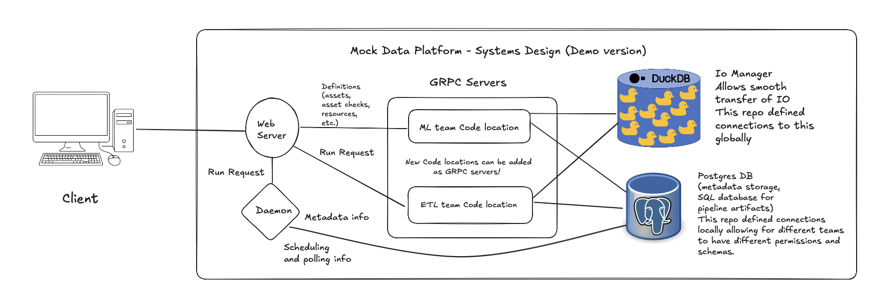
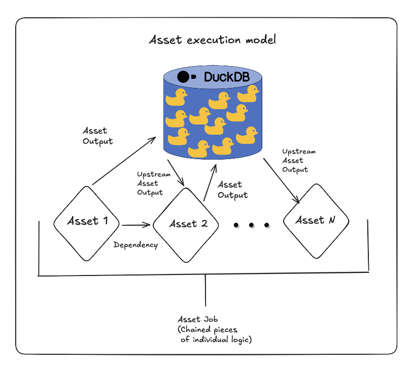

# Architecture

## Purpose

This document describes the architectural decisions, invariants, and operational boundaries of the **Data Platform Sample**.

Its goal is to explain **why the system is structured the way it is**, what guarantees it provides, and how it is expected to evolve over time. This is not an implementation guide; it is a *reasoning guide* intended for maintainers, reviewers, and future contributors.

The following diagrams are referenced throughout this document:

**System design overview**

**Asset execution and validation model**

---

## Taking This to Production

This project is built as a **local-first reference implementation** to mock a production data platform. It is intentionally constrained to run locally to avoid hosting and cloud costs but can be translated to a fully operational production environment.  

Dagster in this project is split into three components, which can remain the same in production:

1. **Webserver** – serves the Dagster UI; can run in a small pod.  
2. **Daemon** – schedules and monitors jobs; can run in a small pod.  
3. **Code location** – executes pipeline logic and assets; can leverage `K8sJobExecutor` to launch ephemeral pods for jobs or assets.

Data sources in production could include SFTP servers, cloud databases, external APIs, or any Python-accessible data source.  

Potential modifications to make this project production-ready include:  

- Replacing **DuckDB** with **S3** as the IO manager.  
- Replacing **local Postgres** with a managed **cloud SQL database**.  
- Adding production-grade networking, secrets management, and CI/CD pipelines.

This section signals that the platform design **anticipates production deployment** while keeping the demo fully local and cost-free.

---

## Architectural Principles

### 1. Isolation Over Coordination

The platform is designed to minimize coordination between teams.

Each team:
- Owns its execution environment
- Deploys independently
- Fails independently

This sharply reduces blast radius and allows teams to move at different speeds without introducing central bottlenecks or implicit coupling.

---

### 2. Centralized Orchestration, Decentralized Execution

The architecture deliberately separates:
- **Control Plane** responsibilities
- **Execution Plane** responsibilities

The control plane provides consistent orchestration semantics and visibility, while execution is fully decentralized. This prevents orchestration infrastructure from becoming a shared compute bottleneck and keeps domain logic isolated.

---

### 3. Validation as a Gate, Not a Signal

Validation is enforced as a **hard gate** to execution.

If data does not satisfy declared invariants:
- Downstream computation does not proceed
- Partial or unsafe results are not produced
- Failures are explicit, localized, and inspectable

Correctness is enforced structurally rather than relying on convention or process.

---

## System Architecture Overview

At a high level, the platform consists of a single orchestration control plane and multiple independently deployed execution environments. The control plane never executes business logic. All computation occurs inside team-owned code locations.

---

## Control Plane

The control plane consists of:
- 2 Dagster instances (webserver + daemon)
- A shared metadata store tracking runs, assets, checks, and execution state

### Responsibilities
- Dependency resolution
- Execution ordering
- Scheduling and sensor evaluation
- State tracking and observability
- Enforcement of asset check gating

### Non-responsibilities
- Business logic
- Data transformation
- Domain correctness
- Team-specific compute

The control plane is intentionally kept simple and as stateless as possible, aside from metadata persistence.

---

## Execution Plane

Each team runs a **code location** as a gRPC server.

A code location:
- Defines assets and asset checks
- Encodes domain-specific logic
- Is deployed independently of other teams
- Executes all compute for its owned assets

Execution-plane failures are intentionally isolated by design.

---

## Code Locations (Teams)

Each directory under `code_locations/` represents a **team-owned execution unit**, with the exception of `shared/`, which provides common connection utilities and reusable templates.

A code location:
- Defines assets and asset checks
- Encodes domain-specific business logic
- Is registered with the control plane via `workspace.yaml`
- Handles all computation for its assets

### Onboarding a New Team

1. Create a new code location directory
2. Define assets and asset checks
3. Register the location in `workspace.yaml`
4. Deploy the gRPC server

No changes to existing teams or pipelines are required.

---

## Asset Checks as Contracts

Asset checks are treated as **runtime-enforced contracts**.

They encode:
- Data shape expectations
- Semantic invariants
- Safety conditions for downstream execution

If a check fails:
- Downstream assets are blocked
- The failure is visible and localized
- No partial or unsafe computation proceeds

This makes data quality guarantees explicit and mechanically enforced.

---

## Invariants

The system enforces the following non-negotiable invariants:

1. **Isolation Invariant**  
   A failure in one team’s code location cannot prevent another team’s pipelines from executing.

2. **Validation Invariant**  
   Downstream assets cannot execute unless all upstream asset checks pass.

3. **Ownership Invariant**  
   - Each asset and asset check has a single owning team.
   - No implicit cross-team ownership is assumed.

These invariants define the safety and autonomy guarantees of the platform.

---

## Failure Modes

### Code Location Failure
- **Impact:** Only the owning team
- **Effect:** gRPC server becomes unavailable
- **Recovery:** Team redeploys independently

### Asset Check Failure
- **Impact:** Downstream lineage only
- **Effect:** Execution is blocked
- **Recovery:** Data corrected or invariant adjusted

### Control Plane Failure
- **Impact:** All teams
- **Effect:** Scheduling and orchestration unavailable
- **Recovery:** Restart control plane services

---

## Multi-Team Model

Teams interact with the platform through **convention, not coordination**.

The platform assumes:
- Teams do not share assets by default
- Cross-team dependencies require explicit agreement
- Teams own their own correctness guarantees

This model prioritizes autonomy while preserving consistent execution semantics across the system.

---

## Platform Guarantees

This platform guarantees that:
- Pipelines only execute on validated data
- Failures are isolated to the owning team
- Execution semantics are consistent across teams

This platform explicitly does **not** guarantee:
- Backward compatibility of team-defined schemas
- Cross-team data correctness
- Business-level SLAs

Those guarantees remain team-owned concerns.

---

## Explicit Non-Goals

This architecture intentionally does **not** attempt to solve:
- Cross-team schema governance
- Business-domain ontologies
- Cost optimization
- Organizational policy enforcement
- Advanced observability (metrics, traces, alerts)

These concerns require product and organizational decisions beyond the scope of this reference implementation.

---

## Evolution Strategy

This reference implementation avoids premature governance by design.

In a production system, likely extensions would include:
- Versioned asset schemas
- Schema compatibility checks
- Dataset discovery and ownership metadata
- Resource quotas and fairness policies
- First-class observability primitives

These capabilities are orthogonal to orchestration and can be layered incrementally without changing the core architecture.

## Production Mapping (Local → Production)

The following table shows how the local-first implementation can map to a production-ready environment:

| Local Component        | Production Equivalent / Suggestion                     |
|------------------------|--------------------------------------------------------|
| Dagster Webserver      | Kubernetes deployment or Dagster Cloud UI             |
| Dagster Daemon         | Small Kubernetes pod(s) for scheduling and monitoring |
| Code Location          | gRPC server; can use `K8sJobExecutor` to launch pods for jobs/assets |
| DuckDB                 | S3 / Data lake IO manager                               |
| Local Postgres         | Managed cloud SQL database (Postgres, MySQL, etc.)    |
| Mock data sources      | SFTP, external APIs, cloud DBs, or other Python-accessible sources |
| Local Makefile / Compose| CI/CD pipelines (GitHub Actions, Jenkins, ArgoCD)     |

**Notes:**
- Webserver and daemon pods can remain lightweight, while compute-heavy jobs are executed in ephemeral pods via `K8sJobExecutor`.
- This mapping preserves the **three-component structure** (Webserver, Daemon, Code Location) from the local demo, ensuring that production adoption is conceptually straightforward.
- Security, monitoring, and secrets management would be added in production, but the core orchestration architecture remains unchanged.
- Secrets and configs would be mounted as volumes in  respective subdirectories of the config directory in the code_locations via K8s ConfigMaps and Secrets. 

---

## Summary

This architecture prioritizes:
- **Clarity over cleverness**
- **Isolation over coordination**
- **Validation over convention**

The result is a system that is easy to reason about, difficult to misuse, and safe to evolve as organizational complexity grows.

